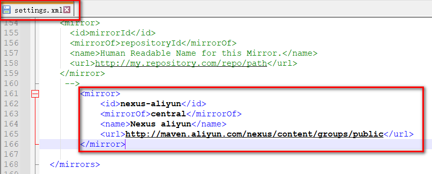
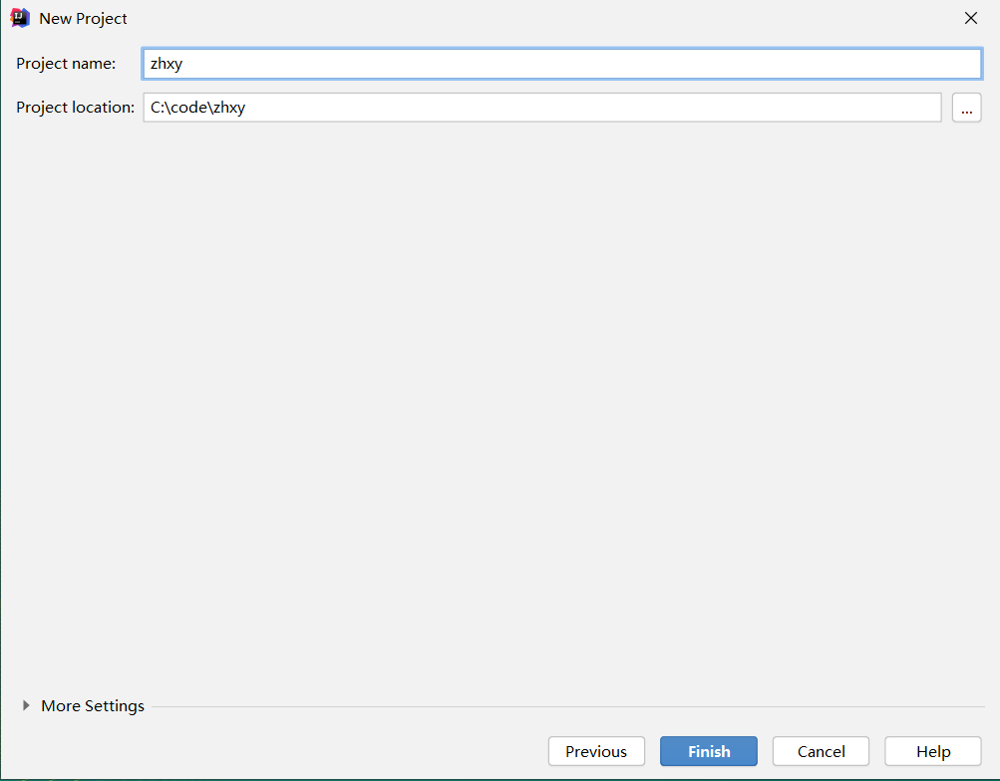
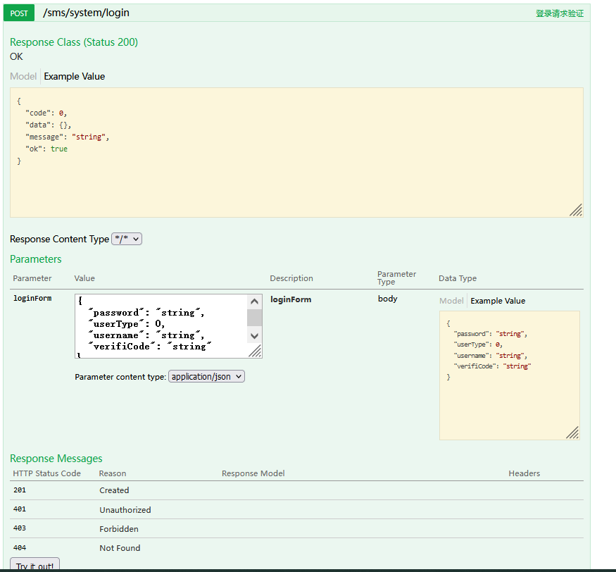
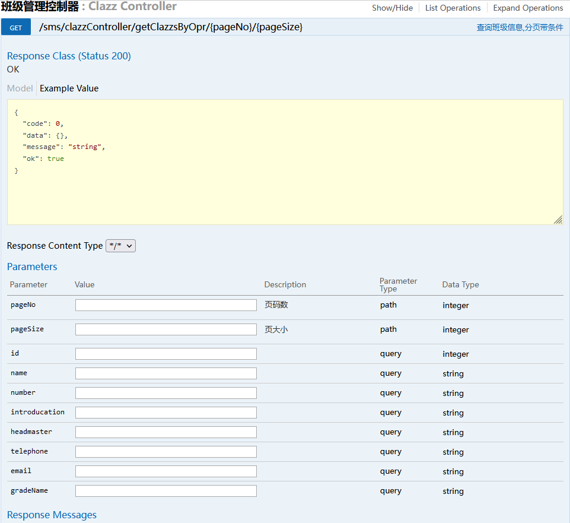
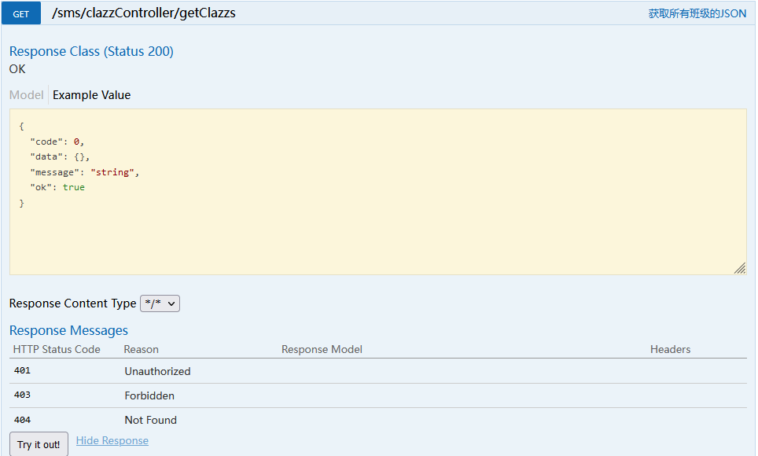

# 尚硅谷\_毕设项目系列教程\_智慧校园管理系统

# 一 毕设项目展示

## 1 登录及角色控制


## 2首页展示


## 3 业务模块展示


# 二 智慧校园系统简介

## 2.1  项目简介

 智慧校园管理系统：主要是以年级、班级为单位，进行老师和学生信息记录和统计功能。项目采用前后端分离架构思想，前端采用HTML+CSS+VUE来实现页面效果展示，后端采用SpringBoot+MybatisPlus框架实现数据存储等服务。存储层使用高性能的MySQL，服务器使用SpringBoot内置的Tomcat9.x，项目构建工具使用Maven来管理jar包和项目构建。

## 2.2 项目模块


## 2.3 技术栈


> `VUE` 
>是一套用于构建用户界面的**渐进式框架**。与其它大型框架不同的是，Vue 被设计为可以自底向上逐层应用。Vue 的核心库只关注视图层，不仅易于上手，还便于与第三方库或既有项目整合。另一方面，当与现代化的工具链以及各种支持类库结合使用时，Vue 也完全能够为复杂的单页应用提供驱动。 前后端分离是目前一种非常流行的开发模式，它使项目的分工更加明确：后端：负责处理、存储数据. 前端：负责显示数据 前端和后端开发人员通过 接口 进行数据的交换。
> `Spring`
> 　Spring就像是整个项目中装配bean的大工厂，在配置文件中可以指定使用特定的参数去调用实体类的构造方法来实例化对象。也可以称之为项目中的粘合剂。
> 　Spring的核心思想是IoC（控制反转），即不再需要程序员去显式地`new`一个对象，而是让Spring框架帮你来完成这一切。
>
> `SpringMVC`
> 　SpringMVC在项目中拦截用户请求，它的核心Servlet即DispatcherServlet承担中介或是前台这样的职责，将用户请求通过HandlerMapping去匹配Controller，Controller就是具体对应请求所执行的操作。SpringMVC相当于SSH框架中struts。
> `mybatis-plus`
> 　mybatis是对jdbc的封装，它让数据库底层操作变的透明。mybatis的操作都是围绕一个sqlSessionFactory实例展开的。mybatis通过配置文件关联到各实体类的Mapper文件，Mapper文件中配置了每个类对数据库所需进行的sql语句映射。在每次与数据库交互时，通过sqlSessionFactory拿到一个sqlSession，再执行sql命令。`MyBatis-plus`就是在MyBatis的基础上,为Mapper接口,Service层提供一些比较全面的CURD的业务逻辑功能,使程序员可以减少在Mapper和Service层的代码编写
>
> `MVC项目架构`
>
> 页面发送请求给控制器，控制器调用业务层处理逻辑，逻辑层向持久层发送请求，持久层与数据库交互，后将结果返回给业务层，业务层将处理逻辑发送给控制器，控制器再调用视图展现数据。

## 2.4  软件环境


### 2.4.1 安装数据库

•    **1.** **开放源代码** 

MySQL最强大的优势之一在于它是一个开放源代码的数据库管理系统。开源的特点是给予了用户根据自己需要修改DBMS的自由。MySQL采用了General Public License，这意味着授予用户阅读、修改和优化源代码的权利，这样即使是免费版的MySQL的功能也足够强大，这也是为什么MySQL越来越受欢迎的主要原因。 

•    **2.** **跨平台** 

MySQL可在不同的操作系统下运行，简单地说，MySQL可以支持Windows系统、UNIX系统、Linux系统等多种操作系统平台。这意味着在一个操作系统中实现的应用程序可很方便移植到其他操作系统下。 

•    **3.** **轻量级** 

MySQL的核心程序完全采用多线程编程，这些线程都是轻量级的进程，它在灵活地为用户提供服务的同时，又不会占用过多的系统资源。因此MySQL能够更快速、高效的处理数据。 

•    **4.** **成本低** 

MySQL分为社区版和企业版，社区版是完全免费的，而企业版是收费的。即使在开发中需要用到一些付费的附加功能，价格相对于昂贵的Oracle、DB2等也是有很大优势的。其实免费的社区版也支持多种数据类型和正规的SQL查询语言，能够对数据进行各种查询、增加、删除、修改等操作，所以一般情况下社区版就可以满足开发需求了，而对数据库可靠性要求比较高的企业可以选择企业版。 


社区版与企业版主要的区别是： 

□    社区版包含所有MySQL的最新功能，而企业版只包含稳定之后的功能。换句话说，社区版可以理解为是企业版的测试版。 

□    官方的支持服务只是针对企业版，如果用户在使用社区版时出现了问题，MySQL官方是不负责任的。  


> 官网下载社区版安装包

​        官方下载网址是：https://dev.mysql.com/downloads/mysql/  


MySQL Installer for Windows：MySQL8的windows安装版下载。点击GO to Download Pages>前往下载。入下图所示：


此处选择Windows (x86, 32-bit)MSI Installer版本，在32-bit、64位系统下均可运行。下载后如下图所示。


> 双击MySQL安装文件mysql-installer-community-8.0.18.0.msi，出现安装类型选项。

1. Developer Default：开发者默认

2. Server only：只安装服务器端

3. Client only：只安装客户端

4. Full：安装全部选项

5. Custom：自定义安装

初学者建议选项为Developer Default、Server only，熟悉MySQL的用户可以选择Custom选项。**此处选择Server only**。安装最快，内容够用。


如果选择custom选项，就需要从左边可用产品列表available Product中选择需要安装的选项，加入到右边的要安装产品列表 Product/Features to be Installed中。


> 进入Installation窗口，发现只有MySQL Server一个product。点击Execute按钮进入安装过程，会显示进度条，完成后点击Next按钮继续。


> 进入产品配置向导，配置多个安装细节，点击Next按钮即可。  


> 高可靠性High Availability，采用默认选项即可。

1. Standalone MySQL Server/Classic MySQL Replication:独立MySQL服务器/经典MySQL复制

2. InnoDB Cluster:InnoDB集群


> 类型和网络 Type and Networking，采用默认选项即可。记住MySQL的监听端口默认是3306。  


> 身份验证方法Authentication Method，采用默认选项即可


> 账户和角色 Accounts and Roles。MySQL管理员账户名称是root，在此处指定root用户的密码。还可以在此处通过Add User按钮添加其他新账户，此处省略该操作。  


> Windows服务：Windows Service。

​	Configure MySQL Server as a Windows Service:给MySQL服务器配置一个服务项。

​	Windows Service Name:服务名称，采用默认名称MySQL80即可。

​	Start the MySQL at System Startup：系统启动时开启MySQL服务


> Apply Configuration：点击Execute按钮执行开始应用这些配置项。

​	Writing configuration file: 写配置文件。

​	Updating Windows Firewall rules：更新Windows防火墙规则

​	Adjusting Windows services：调整Windows服务

​	Initializing database：初始化数据库

​	Starting the server： 启动服务器

​	Applying security setting：应用安全设置

​	Updating the Start menu link：更新开始菜单快捷方式链接


> 执行完成后，如下图所示。单击Finish完成安装，进入产品配置环节。


> 产品配置Product Configuration到此结束：点击Next按钮。  


> 安装完成 Installation Complete。点击Finish按钮完成安装  


> 启动和关闭MySQL服务

win+r 输入 services.msc 查看Windows服务


> 检查mysql默认的安装位置


> 配置环境变量

设置环境变量path，增加MySQL8的执行文件的路径，访问该目录下文件无需cd到该目录下，路径为：C:\Program Files\MySQL\MySQL Server 8.0\bin。注意：使用分号;分割path中各个路径。

path：C:\Program Files\MySQL\MySQL Server 8.0\bin


> 登录mysql


### 2.4.2 安装数据库客户端工具

> Navicat是一套快速、可靠并价格相当便宜的数据库管理工具，专为简化数据库的管理及降低系统管理成本而设。它的设计符合数据库管理员、开发人员及中小企业的需要。Navicat 是以直觉化的图形用户界面而建的，让你可以以安全并且简单的方式创建、组织、访问并共用信息。Navicat Premium 是一套数据库开发工具，让你从单一应用程序中同时连接 MySQL、MariaDB、MongoDB、SQL Server、Oracle、PostgreSQL 和 SQLite 数据库。它与 Amazon RDS、Amazon Aurora、Amazon Redshift、Microsoft Azure、Oracle Cloud、MongoDB Atlas、阿里云、腾讯云和华为云等云数据库兼容。你可以快速轻松地创建、管理和维护数据库。


直接解压安装包，拷贝到合适目录下，双击其中的navicat.exe，即可开始运行。打开后选择 连接工具按钮----连接，输入四个连接连接参数，并进行测试，结果提示连接失败，报2059异常。


该错误的原因是在MySQL8之前版本中加密规则mysql_native_password，而在MySQL8以后的加密规则为caching_sha2_password。解决此问题有两种方法，一种是更新navicat驱动来解决此问题，一种是将mysql用户登录的加密规则修改为mysql_native_password。此处采用第二种方式。

设置密码永不过期

alter user 'root'@'localhost' identified by 'root' password expire never;

设置加密规则为mysql_native_password

alter user 'root'@'localhost' identified with mysql_native_password by 'root';


重新访问navicat，提示连接成功。


安装完成连接mysql

1、输入连接ip地址，用户名和密码，如果连接成功，则表示mysql安装没有问题


### 2.4.3 安装JDK

JDK详细教程请参考尚硅谷官方免费教程

http://www.atguigu.com/download_detail.shtml?v=129

https://www.bilibili.com/video/BV1Kb411W75N?p=30

版本：java1.8

验证安装是否成功

1、打开cmd窗口

2、输入java –version


### 2.4.4 安装IDEA 

建议使用IntelliJ IDEA 2019.2 x64及以上版本

IntelliJ IDEA详细使用教程请参考尚硅谷官方免费教程

http://www.atguigu.com/download_detail.shtml?v=11

https://www.bilibili.com/video/BV1PW411X75p?p=4

### 2.4.5 安装Maven


> Maven是Apache软件基金会组织维护的一款专门为Java项目提供**构建**和**依赖**管理支持的工具。


> Maven的下载

下载地址:http://maven.apache.org/  

​           

​           

​           


> Maven的环境变量配置

检查JAVA_HOME环境变量。Maven是使用Java开发的，所以必须知道当前系统环境中JDK的安装目录。


> 解压Maven的核心程序

将apache-maven-3.6.3-bin.zip解压到一个**非中文无空格**的目录下。例如  


> 配置Maven的环境变量

+ MAVEN_HOME

``` shell
D:\apache-maven-3.6.3
```

+ path

``` shell
%MAVEN_HOME%\bin
```

Maven：MAVEN_HOME(低版本中使用MAVEN_HOME，高版本中推荐使用M2_HOME)  

​         


  


​         

  


> 验证Maven安装是否正确

+ 使用下面的指令在DOS上验证maven安装是否成功

+ mvn -v或者mvn -version


> 配置Maven本地仓库

​		Maven的核心程序并不包含具体功能，仅负责宏观调度。具体功能由插件来完成。Maven核心程序会到本地仓库中查找插件。如果本地仓库中没有就会从远程中央仓库下载。此时如果不能上网则无法执行Maven的具体功能。为了解决这个问题，我们可以将Maven的本地仓库指向一个在联网情况下下载好的目录。Maven默认的本地仓库：~\.m2\repository目录(~表示当前用户的家目录)。


> 配置Maven中央仓库为国内的阿里云

+ 接下来我们需要配置maven镜像，如果我们不配置，我们下载jar包是从国外下载的，下载速度很慢，所以我们配置一下国内的阿里云镜像 

 ``` xml
<mirror>
    <id>nexus-aliyun</id>
    <mirrorOf>central</mirrorOf>
    <name>Nexus aliyun</name>
    <url>http://maven.aliyun.com/nexus/content/groups/public</url>
</mirror>
 ```



> 配置Maven全局JDK版本

 接下来我们可以为maven配置全局的jdk，这样我们在创建maven项目时就会自动使用该jdk版本，目前推荐jdk1.8 

``` xml
	<profile>
		<id>jdk-1.8</id>
		<activation>
			<activeByDefault>true</activeByDefault>
			<jdk>1.8</jdk>
		</activation>
		<properties>
			<maven.compiler.source>1.8</maven.compiler.source>
			<maven.compiler.target>1.8</maven.compiler.target>
			<maven.compiler.compilerVersion>1.8</maven.compiler.compilerVersion>
		</properties>
	</profile>
```


> 查看Idea自带Maven插件

Idea中其实自带Maven插件，而且我们也可以给自带的Maven插件进行配置，所以我们可以使用自带的Maven，也可以使用我们安装的Maven核心程序


> 设置Maven自动导包

设置Maven自动导包,勾选次选项时,每次添加依赖maven都会给我们立刻自动导入,但是我们往往不勾选,每次添加新的依赖时我们手动集中导入一次. 在比较新新的Idea中已经没有该选项


> Idea中配置使用我们自己安装的Maven插件


> 优化Maven的Runner参数

优化配置：-DarchetypeCatalog=internal 每次创建项目时，IDEA要使用插件进行创建，这些插件当创建新项目时，它每次都会去中央仓库下载，这样使得创建比较慢。应该在创建时让它找本地仓库中插件进行创建项目。(-D代表属性,后面是key=value的形式配置参数)


**注意:某些版本的Idea在设置了Maven之后,每次创建一个项目的时候都会失效!!! 如2019.2.4版本,所以大家以后每次创建Maven项目的时候一定要检查一下Idea的Maven配置**

>  上述配置也可以在  other settings > Settings for New Project中进行

​           


### 2.4.6 安装Tomcat

只需要解压，最好目录中不要出现中文。目前使用SpringBoot内置Tomcat即可


#  三 智慧校园系统功能开发

## 3.1 项目搭建

### 3.1.1 使用IDEA的SpringBoot脚手架创建一个Maven项目

> 创建新项目 选择Spring Initializr


> 填写 group和artiface  选择JAVA version


> 添加组件和选择SpringBoot版本,暂时使用默认即可,后面我们自己添加项目依赖和修改SpringBoot版本


> 查看项目名以及项目的存放路径, 然后finish



> 创建完毕后,检查项目的Maven配置,安装Lombok插件,启动注解处理,然后重启idea

1. Lombok插件


2. 开启注解处理


3. 检查maven配置


### 3.1.2在pom.xml中到导入相关依赖

``` xml
<?xml version="1.0" encoding="UTF-8"?>
<project xmlns="http://maven.apache.org/POM/4.0.0"
         xmlns:xsi="http://www.w3.org/2001/XMLSchema-instance"
         xsi:schemaLocation="http://maven.apache.org/POM/4.0.0 http://maven.apache.org/xsd/maven-4.0.0.xsd">
	<!-- 继承方式使用SpringBoot -->
    <parent>
        <groupId>org.springframework.boot</groupId>
        <artifactId>spring-boot-starter-parent</artifactId>
        <version>2.2.1.RELEASE</version>
        <relativePath/> 
    </parent>

    <artifactId>zhxy</artifactId>
    <groupId>com.atguigu</groupId>
    <packaging>war</packaging>
    <modelVersion>4.0.0</modelVersion>

    <dependencies>

        <dependency>
            <groupId>org.springframework.boot</groupId>
            <artifactId>spring-boot-starter</artifactId>
        </dependency>
        <dependency>
            <groupId>org.springframework.boot</groupId>
            <artifactId>spring-boot-starter-web</artifactId>
        </dependency>
        <!--单元测试启动器-->
        <dependency>
            <groupId>org.springframework.boot</groupId>
            <artifactId>spring-boot-starter-test</artifactId>
            <scope>test</scope>
        </dependency>
        <!-- thymeleaf支持-->
        <dependency>
            <groupId>org.springframework.boot</groupId>
            <artifactId>spring-boot-starter-thymeleaf</artifactId>
        </dependency>

        <!--  mybatis-plus-->
        <dependency>
            <groupId>com.baomidou</groupId>
            <artifactId>mybatis-plus-boot-starter</artifactId>
            <version>3.3.1</version>
        </dependency>

        <!-- 简化POJO实体类开发 -->
        <dependency>
            <groupId>org.projectlombok</groupId>
            <artifactId>lombok</artifactId>
            <optional>true</optional>
        </dependency>

        <!--mysql-->
        <dependency>
            <groupId>mysql</groupId>
            <artifactId>mysql-connector-java</artifactId>
        </dependency>

        <dependency>
            <groupId>com.baomidou</groupId>
            <artifactId>mybatis-plus-generator</artifactId>
            <version>3.3.1</version>
        </dependency>
        <dependency>
            <groupId>org.freemarker</groupId>
            <artifactId>freemarker</artifactId>
            <version>2.3.31</version>
        </dependency>

        <!--swagger-->
        <dependency>
            <groupId>io.springfox</groupId>
            <artifactId>springfox-swagger2</artifactId>
            <version>2.7.0</version>
        </dependency>
        <!--swagger ui-->
        <dependency>
            <groupId>io.springfox</groupId>
            <artifactId>springfox-swagger-ui</artifactId>
            <version>2.7.0</version>
        </dependency>
        <!--swagger2  增强版接口文档-->
        <dependency>
            <groupId>com.github.xiaoymin</groupId>
            <artifactId>knife4j-spring-boot-starter</artifactId>
            <version>2.0.4</version>
        </dependency>


        <!--开发者工具-->
        <dependency>
            <groupId>org.springframework.boot</groupId>
            <artifactId>spring-boot-devtools</artifactId>
            <optional>true</optional>
        </dependency>

        <dependency>
            <groupId>com.alibaba</groupId>
            <artifactId>fastjson</artifactId>
            <version>1.2.29</version>
        </dependency>

        <!-- JWT生成Token-->
        <dependency>
            <groupId>io.jsonwebtoken</groupId>
            <artifactId>jjwt</artifactId>
            <version>0.7.0</version>
        </dependency>

        <dependency>
            <groupId>commons-fileupload</groupId>
            <artifactId>commons-fileupload</artifactId>
            <version>1.4</version>
        </dependency>

    </dependencies>

    <build>
        <plugins>
            <!--spring boot maven插件 , 可以将项目运行依赖的jar包打到我们的项目中-->
            <plugin>
                <groupId>org.springframework.boot</groupId>
                <artifactId>spring-boot-maven-plugin</artifactId>
            </plugin>
        </plugins>
    </build>

</project>
```

### 3.1.3 准备项目结构

1. java目录下
    1. config : 项目的配置类
    2. controller: 控制层
    3. mapper : 持久层接口
    4. pojo :  实体类
    5. service: 服务层
    6. util: 工具类包
    7. ZhxyApplication : 启动类

2. resources目录下
    1. mapper :持久层映射文件
    2. public/upload:文件上传目录
    3. static: 静态资源目录
    4. application.yml :SpringBoot核心配置文件 


### 3.1.4准备application.yml配置文件

``` yaml
server:
  port: 9001
spring:
  #解决SpringBoot2.6.0与swagger冲突问题【原因是在springboot2.6.0中将SpringMVC 默认路径匹配策略从AntPathMatcher 更改为PathPatternParser，导致出错，解决办法是切换回原先的AntPathMatcher】
  mvc:
    pathmatch:
      matching-strategy: ant_path_matcher
  #配置数据源
  datasource:
    #配置数据源类型
    type: com.zaxxer.hikari.HikariDataSource
    #配置数据库连接属性
    driver-class-name: com.mysql.cj.jdbc.Driver
    url: jdbc:mysql://localhost:3306/sgg_zhxy_db?characterEncoding=utf-8&serverTimezone=GMT%2B8&userSSL=false
    username: root
    password: root
    #url: jdbc:mysql://r2czkq1vewxat78mnyg60oisurj5h4dp.mysql.qingcloud.link:3306/ssg_zhxy_db?characterEncoding=utf-8&serverTimezone=GMT%2B8&userSSL=false
    #username: shangguigu
    #password: shangguigu@QY123
    #mybatis-plus内置连接池
    hikari:
      connection-test-query: SELECT 1
      connection-timeout: 60000
      idle-timeout: 500000
      max-lifetime: 540000
      maximum-pool-size: 12
      minimum-idle: 10
      pool-name: GuliHikariPool
  thymeleaf:
    #模板的模式，支持 HTML, XML TEXT JAVASCRIPT
    mode: HTML5
    #编码 可不用配置
    encoding: UTF-8
    #开发配置为false,避免修改模板还要重启服务器
    cache: false
    #配置模板路径，默认是templates，可以不用配置
    prefix: classpath:/static/
  jackson:
    date-format: yyyy-MM-dd HH:mm:ss
    time-zone: GMT+8
  servlet:
    #设置文件上传上限
    multipart:
      max-file-size: 10MB
      max-request-size: 100MB
mybatis-plus:
  configuration:
    #添加日志支持
    log-impl: org.apache.ibatis.logging.stdout.StdOutImpl
  mapper-locations: classpath*:/mapper/**/*.xml
```

配置多个配置文件

配置数据库文件 application-db.yml   【文件名 application-xx.yml】

```yaml
spring:
  datasource:
     #配置数据库连接属性
     driver-class-name: com.mysql.cj.jdbc.Driver
     #数据库连接驱动8.0.25不需要设置时区
     url: jdbc:mysql://localhost:3306/zhxy_db
     username: root
     password: Abin21428!!
```

在主配置文件application.yml中激活  

```yaml
spring:
	profiles:
	#写明xx的名字
	 active: db
```


###  3.1.5准备分页插件的配置类

``` java
package com.atguigu.zhxy.config;

import com.baomidou.mybatisplus.extension.plugins.PaginationInterceptor;
import org.mybatis.spring.annotation.MapperScan;
import org.springframework.context.annotation.Bean;
import org.springframework.context.annotation.Configuration;

@Configuration
@MapperScan("com.atguigu.zhxy.mapper")
public class MpConfig {

    /**
     * 分页插件
     */
    @Bean
    public PaginationInterceptor paginationInterceptor() {
        PaginationInterceptor paginationInterceptor = new PaginationInterceptor();
        // paginationInterceptor.setLimit(你的最大单页限制数量，默认 500 条，小于 0 如 -1 不受限制);
        return paginationInterceptor;
    }


}

```


### 3.1.6 准备Swagger2的配置类

``` java 
package com.atguigu.zhxy.config;

import com.google.common.base.Predicates;
import io.swagger.annotations.ApiOperation;
import org.springframework.context.annotation.Bean;
import org.springframework.context.annotation.Configuration;
import springfox.documentation.builders.ApiInfoBuilder;
import springfox.documentation.builders.ParameterBuilder;
import springfox.documentation.builders.PathSelectors;
import springfox.documentation.builders.RequestHandlerSelectors;
import springfox.documentation.schema.ModelRef;
import springfox.documentation.service.ApiInfo;
import springfox.documentation.service.Contact;
import springfox.documentation.service.Parameter;
import springfox.documentation.spi.DocumentationType;
import springfox.documentation.spring.web.plugins.Docket;
import springfox.documentation.swagger2.annotations.EnableSwagger2;

import java.util.ArrayList;
import java.util.List;

/**
 * Swagger2配置信息
 */
@Configuration
@EnableSwagger2
public class Swagger2Config {

    @Bean
    public Docket webApiConfig(){

        //添加head参数start
        List<Parameter> pars = new ArrayList<>();
        ParameterBuilder tokenPar = new ParameterBuilder();
        tokenPar.name("userId")
                .description("用户ID")
                .defaultValue("1")
                .modelRef(new ModelRef("string"))
                .parameterType("header")
                .required(false)
                .build();
        pars.add(tokenPar.build());

        ParameterBuilder tmpPar = new ParameterBuilder();
                tmpPar.name("userTempId")
                .description("临时用户ID")
                .defaultValue("1")
                .modelRef(new ModelRef("string"))
                .parameterType("header")
                .required(false)
                .build();
        pars.add(tmpPar.build());
        //添加head参数end

        return new Docket(DocumentationType.SWAGGER_2)
                .groupName("webApi")
                .apiInfo(webApiInfo())
                .select()
                //可以测试请求头中：输入token
                .apis(RequestHandlerSelectors.withClassAnnotation(ApiOperation.class))
                //过滤掉admin路径下的所有页面
                //.paths(Predicates.and(PathSelectors.regex("/sms/.*")))
                //过滤掉所有error或error.*页面
                //.paths(Predicates.not(PathSelectors.regex("/error.*")))
                .build()
                .globalOperationParameters(pars);

    }

   

    private ApiInfo webApiInfo(){

        return new ApiInfoBuilder()
                .title("网站-API文档")
                .description("本文档描述了网站微服务接口定义")
                .version("1.0")
                .contact(new Contact("atguigu", "http://atguigu.com", "512111559@qq.com"))
                .build();
    }

    private ApiInfo adminApiInfo(){

        return new ApiInfoBuilder()
                .title("后台管理系统-API文档")
                .description("本文档描述了后台管理系统微服务接口定义")
                .version("1.0")
                .contact(new Contact("atguigu", "http://atguigu.com", "512111559@qq.com"))
                .build();
    }


}

```


### 3.1.7 准备util下的工具类

> 验证码图片工具类

``` java
package com.atguigu.zhxy.util;

import java.awt.*;
import java.awt.image.BufferedImage;
import java.util.Random;

/**
 * @project: ssm_sms
 * @description: 绘制验证码图片
 */
public class CreateVerifiCodeImage {

    private static int WIDTH = 90;
    private static int HEIGHT = 35;
    private static int FONT_SIZE = 20; //字符大小
    private static char[] verifiCode; //验证码
    private static BufferedImage verifiCodeImage; //验证码图片

    /**
     * @description: 获取验证码图片
     * @param: no
     * @return: java.awt.image.BufferedImage
     */
    public static BufferedImage getVerifiCodeImage() {
        verifiCodeImage = new BufferedImage(WIDTH, HEIGHT, BufferedImage.TYPE_INT_BGR);// create a image
        Graphics graphics = verifiCodeImage.getGraphics();

        verifiCode = generateCheckCode();
        drawBackground(graphics);
        drawRands(graphics, verifiCode);

        graphics.dispose();

        return verifiCodeImage;
    }

    /**
     * @description: 获取验证码
     * @param: no
     * @return: char[]
     */
    public static char[] getVerifiCode() {
        return verifiCode;
    }

    /**
     * @description: 随机生成验证码
     * @param: no
     * @return: char[]
     */
    private static char[] generateCheckCode() {
        String chars = "0123456789abcdefghijklmnopqrstuvwxyz" + "ABCDEFGHIJKLMNOPQRSTUVWXYZ";
        char[] rands = new char[4];
        for (int i = 0; i < 4; i++) {
            int rand = (int) (Math.random() * (10 + 26 * 2));
            rands[i] = chars.charAt(rand);
        }
        return rands;
    }

    /**
     * @description: 绘制验证码
     * @param: g
     * @param: rands
     * @return: void
     */
    private static void drawRands(Graphics g, char[] rands) {
        g.setFont(new Font("Console", Font.BOLD, FONT_SIZE));

        for (int i = 0; i < rands.length; i++) {

            g.setColor(getRandomColor());
            g.drawString("" + rands[i], i * FONT_SIZE + 10, 25);
        }
    }

    /**
     * @description: 绘制验证码图片背景
     * @param: g
     * @return: void
     */
    private static void drawBackground(Graphics g) {

        g.setColor(Color.white);
        g.fillRect(0, 0, WIDTH, HEIGHT);

        // 绘制验证码干扰点
        for (int i = 0; i < 200; i++) {
            int x = (int) (Math.random() * WIDTH);
            int y = (int) (Math.random() * HEIGHT);
            g.setColor(getRandomColor());
            g.drawOval(x, y, 1, 1);

        }
    }


    /**
     * @description: 获取随机颜色
     * @param: no
     * @return: java.awt.Color
     */
    private static Color getRandomColor() {
        Random ran = new Random();
        return new Color(ran.nextInt(220), ran.nextInt(220), ran.nextInt(220));
    }
}

```


> token口令生成工具 JwtHelper

``` java 
package com.atguigu.zhxy.util;

import io.jsonwebtoken.*;
import org.springframework.util.StringUtils;

import java.util.Date;

public class JwtHelper {
    private static long tokenExpiration = 24*60*60*1000;
    private static String tokenSignKey = "123456";

    //生成token字符串
    public static String createToken(Long userId, Integer userType) {
        String token = Jwts.builder()

                .setSubject("YYGH-USER")

                .setExpiration(new Date(System.currentTimeMillis() + tokenExpiration))

                .claim("userId", userId)
//                .claim("userName", userName)
                .claim("userType", userType)

                .signWith(SignatureAlgorithm.HS512, tokenSignKey)
                .compressWith(CompressionCodecs.GZIP)
                .compact();
        return token;
    }

    //从token字符串获取userid
    public static Long getUserId(String token) {
        if(StringUtils.isEmpty(token)) return null;
        Jws<Claims> claimsJws = Jwts.parser().setSigningKey(tokenSignKey).parseClaimsJws(token);
        Claims claims = claimsJws.getBody();
        Integer userId = (Integer)claims.get("userId");
        return userId.longValue();
    }

    //从token字符串获取userType
    public static Integer getUserType(String token) {
        if(StringUtils.isEmpty(token)) return null;
        Jws<Claims> claimsJws
                = Jwts.parser().setSigningKey(tokenSignKey).parseClaimsJws(token);
        Claims claims = claimsJws.getBody();
        return (Integer)(claims.get("userType"));
    }

    //从token字符串获取userName
    public static String getUserName(String token) {
        if(StringUtils.isEmpty(token)) return "";
        Jws<Claims> claimsJws
                = Jwts.parser().setSigningKey(tokenSignKey).parseClaimsJws(token);
        Claims claims = claimsJws.getBody();
        return (String)claims.get("userName");
    }

    //判断token是否有效
    public static boolean isExpiration(String token){
        try {
            boolean isExpire = Jwts.parser()
                    .setSigningKey(tokenSignKey)
                    .parseClaimsJws(token)
                    .getBody()
                    .getExpiration().before(new Date());
            //没有过期，有效，返回false
            return isExpire;
        }catch(Exception e) {
            //过期出现异常，返回true
            return true;
        }
    }


    /**
     * 刷新Token
     * @param token
     * @return
     */
    public String refreshToken(String token) {
        String refreshedToken;
        try {
            final Claims claims = Jwts.parser()
                    .setSigningKey(tokenSignKey)
                    .parseClaimsJws(token)
                    .getBody();
            refreshedToken = JwtHelper.createToken(getUserId(token), getUserType(token));
        } catch (Exception e) {
            refreshedToken = null;
        }
        return refreshedToken;
    }

        public static void main(String[] args) {
//        String token = JwtHelper.createToken(1L, "lucy");
//        System.out.println(token);
//        System.out.println(JwtHelper.getUserId(token));
//        System.out.println(JwtHelper.getUserName(token));
    }
}

```


>解析request请求中的 token口令的工具AuthContextHolder

``` java
package com.atguigu.zhxy.util;

import javax.servlet.http.HttpServletRequest;

public class AuthContextHolder {

    //从请求头token获取userid
    public static Long getUserIdToken(HttpServletRequest request) {
        //从请求头token
        String token = request.getHeader("token");
        //调用工具类
        Long userId = JwtHelper.getUserId(token);
        return userId;
    }

    //从请求头token获取name
    public static String getUserName(HttpServletRequest request) {
        //从header获取token
        String token = request.getHeader("token");
        //jwt从token获取username
        String userName = JwtHelper.getUserName(token);
        return userName;
    }
}

```


> MD5加密工具类

``` java
package com.atguigu.zhxy.util;

import java.security.MessageDigest;
import java.security.NoSuchAlgorithmException;


public final class MD5 {

    public static String encrypt(String strSrc) {
        try {
            char hexChars[] = { '0', '1', '2', '3', '4', '5', '6', '7', '8',
                    '9', 'a', 'b', 'c', 'd', 'e', 'f' };
            byte[] bytes = strSrc.getBytes();
            MessageDigest md = MessageDigest.getInstance("MD5");
            md.update(bytes);
            bytes = md.digest();
            int j = bytes.length;
            char[] chars = new char[j * 2];
            int k = 0;
            for (int i = 0; i < bytes.length; i++) {
                byte b = bytes[i];
                chars[k++] = hexChars[b >>> 4 & 0xf];
                chars[k++] = hexChars[b & 0xf];
            }
            return new String(chars);
        } catch (NoSuchAlgorithmException e) {
            e.printStackTrace();
            throw new RuntimeException("MD5加密出错！！+" + e);
        }
    }


}

```

> JSON响应结果格式封装类

``` java
package com.atguigu.zhxy.util;

import io.swagger.annotations.ApiModel;
import io.swagger.annotations.ApiModelProperty;
import lombok.Data;

/**
 * 全局统一返回结果类
 *
 */
@Data
@ApiModel(value = "全局统一返回结果")
public class Result<T> {

    @ApiModelProperty(value = "返回码")
    private Integer code;

    @ApiModelProperty(value = "返回消息")
    private String message;

    @ApiModelProperty(value = "返回数据")
    private T data;

    public Result(){}

    // 返回数据
    protected static <T> Result<T> build(T data) {
        Result<T> result = new Result<T>();
        if (data != null)
            result.setData(data);
        return result;
    }

    public static <T> Result<T> build(T body, ResultCodeEnum resultCodeEnum) {
        Result<T> result = build(body);
        result.setCode(resultCodeEnum.getCode());
        result.setMessage(resultCodeEnum.getMessage());
        return result;
    }

    public static<T> Result<T> ok(){
        return Result.ok(null);
    }

    /**
     * 操作成功
     * @param data
     * @param <T>
     * @return
     */
    public static<T> Result<T> ok(T data){
        Result<T> result = build(data);
        return build(data, ResultCodeEnum.SUCCESS);
    }

    public static<T> Result<T> fail(){
        return Result.fail(null);
    }

    /**
     * 操作失败
     * @param data
     * @param <T>
     * @return
     */
    public static<T> Result<T> fail(T data){
        Result<T> result = build(data);
        return build(data, ResultCodeEnum.FAIL);
    }

    public Result<T> message(String msg){
        this.setMessage(msg);
        return this;
    }

    public Result<T> code(Integer code){
        this.setCode(code);
        return this;
    }

    public boolean isOk() {
        if(this.getCode().intValue() == ResultCodeEnum.SUCCESS.getCode().intValue()) {
            return true;
        }
        return false;
    }
}

```

> 响应结果类型码枚举

``` java
package com.atguigu.zhxy.util;

import lombok.Getter;

/**
 * 统一返回结果状态信息类
 *
 */
@Getter
public enum ResultCodeEnum {

    SUCCESS(200,"成功"),
    FAIL(201, "失败"),
    SERVICE_ERROR(2012, "服务异常"),
    ILLEGAL_REQUEST( 204, "非法请求"),
    PAY_RUN(205, "支付中"),
    ARGUMENT_VALID_ERROR(206, "参数校验错误"),

    LOGIN_ERROR(207, "用户名或密码错误"),
    LOGIN_AUTH(208, "未登陆"),
    PERMISSION(209, "没有权限"),
    SECKILL_NO_START(210, "秒杀还没开始"),
    SECKILL_RUN(211, "正在排队中"),
    SECKILL_NO_PAY_ORDER(212, "您有未支付的订单"),
    SECKILL_FINISH(213, "已售罄"),
    SECKILL_END(214, "秒杀已结束"),
    SECKILL_SUCCESS(215, "抢单成功"),
    SECKILL_FAIL(216, "抢单失败"),
    SECKILL_ILLEGAL(217, "请求不合法"),
    SECKILL_ORDER_SUCCESS(218, "下单成功"),
    COUPON_GET(220, "优惠券已经领取"),
    COUPON_LIMIT_GET(221, "优惠券已发放完毕"),
    //2022-02-22
    LOGIN_CODE(222,"长时间未操作,会话已失效,请刷新页面后重试!"),
    CODE_ERROR(223,"验证码错误!"),
    TOKEN_ERROR(224,"Token无效!")
    ;

    private Integer code;

    private String message;

    private ResultCodeEnum(Integer code, String message) {
        this.code = code;
        this.message = message;
    }
}

```

> 文件上传工具类

``` java
package com.atguigu.zhxy.util;

import org.apache.commons.io.filefilter.SuffixFileFilter;
import org.springframework.web.multipart.MultipartFile;

import java.io.File;
import java.io.IOException;
import java.util.HashMap;
import java.util.Map;
import java.util.UUID;

/**
 * @project: zhxy
 * @description: 上传文件的工具类
 */
public class UploadFile {

    //存储文件上传失败的错误信息
    private static Map<String, Object> error_result = new HashMap<>();
    //存储头像的上传结果信息
    private static Map<String, Object> upload_result = new HashMap<>();

    /**
     * @description: 效验所上传图片的大小及格式等信息...
     * @param: photo
     * @param: path
     * @return: java.util.Map<java.lang.String, java.lang.Object>
     */
    private static Map<String, Object> uploadPhoto(MultipartFile photo, String path) {
        //限制头像大小(20M)
        int MAX_SIZE = 20971520;
        //获取图片的原始名称
        String orginalName = photo.getOriginalFilename();
        //如果保存文件的路径不存在,则创建该目录
        File filePath = new File(path);
        if (!filePath.exists()) {
            filePath.mkdirs();
        }
        //限制上传文件的大小
        if (photo.getSize() > MAX_SIZE) {
            error_result.put("success", false);
            error_result.put("msg", "上传的图片大小不能超过20M哟!");
            return error_result;
        }
        // 限制上传的文件类型
        String[] suffixs = new String[]{".png", ".PNG", ".jpg", ".JPG", ".jpeg", ".JPEG", ".gif", ".GIF", ".bmp", ".BMP"};
        SuffixFileFilter suffixFileFilter = new SuffixFileFilter(suffixs);
        if (!suffixFileFilter.accept(new File(path + orginalName))) {
            error_result.put("success", false);
            error_result.put("msg", "禁止上传此类型文件! 请上传图片哟!");
            return error_result;
        }

        return null;
    }

    /**
     * @description: (提取公共代码 : 提高代码的可重用性)获取头像的上传结果信息
     * @param: photo
     * @param: dirPaht
     * @param: portraitPath
     * @return: java.util.Map<java.lang.String, java.lang.Object>
     */
    public static Map<String, Object> getUploadResult(MultipartFile photo, String dirPaht, String portraitPath) {

        if (!photo.isEmpty() && photo.getSize() > 0) {
            //获取图片的原始名称
            String orginalName = photo.getOriginalFilename();
            //上传图片,error_result:存储头像上传失败的错误信息
            Map<String, Object> error_result = UploadFile.uploadPhoto(photo, dirPaht);
            if (error_result != null) {
                return error_result;
            }
            //使用UUID重命名图片名称(uuid__原始图片名称)
            String newPhotoName = UUID.randomUUID() + "__" + orginalName;
            //将上传的文件保存到目标目录下
            try {
                photo.transferTo(new File(dirPaht + newPhotoName));
                upload_result.put("success", true);
                upload_result.put("portrait_path", portraitPath + newPhotoName);//将存储头像的项目路径返回给页面
            } catch (IOException e) {
                e.printStackTrace();
                upload_result.put("success", false);
                upload_result.put("msg", "上传文件失败! 服务器端发生异常!");
                return upload_result;
            }

        } else {
            upload_result.put("success", false);
            upload_result.put("msg", "头像上传失败! 未找到指定图片!");
        }
        return upload_result;
    }
}

```

### 3.1.8 准备各层基础代码


## 3.2 登录功能后台实现

### 3.2.1 验证码功能实现

> 获取验证码图片及向session中存储验证码功能实现


> SystemController层代码实现

``` java
package com.atguigu.zhxy.controller;

import com.atguigu.zhxy.pojo.Admin;
import com.atguigu.zhxy.pojo.LoginForm;
import com.atguigu.zhxy.service.AdminService;
import com.atguigu.zhxy.service.StudentService;
import com.atguigu.zhxy.service.TeacherService;
import com.atguigu.zhxy.util.CreateVerifiCodeImage;
import com.atguigu.zhxy.util.JwtHelper;
import com.atguigu.zhxy.util.Result;
import io.swagger.annotations.Api;
import io.swagger.annotations.ApiOperation;
import org.springframework.beans.factory.annotation.Autowired;
import org.springframework.stereotype.Controller;
import org.springframework.web.bind.annotation.*;

import javax.imageio.ImageIO;
import javax.servlet.http.HttpServletRequest;
import javax.servlet.http.HttpServletResponse;
import javax.servlet.http.HttpSession;
import java.awt.image.BufferedImage;
import java.io.IOException;
import java.util.HashMap;
import java.util.Map;

@Api(tags = "系统控制器")
@RestController
@RequestMapping("/sms/system")
public class SystemController {

    @ApiOperation("获取验证码图片")
    @GetMapping("/getVerifiCodeImage")
    public void getVerifiCodeImage(HttpServletRequest request, HttpServletResponse response){
        //获取验证码图片
        BufferedImage verifiCodeImage = CreateVerifiCodeImage.getVerifiCodeImage();
        //获取验证码字符串
        String verifiCode = String.valueOf(CreateVerifiCodeImage.getVerifiCode());

        /*将验证码放入当前请求域*/
        request.getSession().setAttribute("verifiCode",verifiCode);
        try {
            //将验证码图片通过输出流做出响应
            ImageIO.write(verifiCodeImage,"JPEG",response.getOutputStream());
        } catch (IOException e) {
            e.printStackTrace();
        }
    }
}
```

> swagger2接口文档查阅


### 3.2.2 登录校验功能实现

> SystemController层代码实现

``` java
package com.atguigu.zhxy.controller;


import com.atguigu.zhxy.pojo.Admin;
import com.atguigu.zhxy.pojo.LoginForm;
import com.atguigu.zhxy.pojo.Student;
import com.atguigu.zhxy.pojo.Teacher;
import com.atguigu.zhxy.service.AdminService;
import com.atguigu.zhxy.service.StudentService;
import com.atguigu.zhxy.service.TeacherService;
import com.atguigu.zhxy.util.CreateVerifiCodeImage;
import com.atguigu.zhxy.util.JwtHelper;
import com.atguigu.zhxy.util.Result;
import io.swagger.annotations.Api;
import io.swagger.annotations.ApiOperation;
import org.springframework.beans.factory.annotation.Autowired;
import org.springframework.stereotype.Controller;
import org.springframework.web.bind.annotation.*;

import javax.imageio.ImageIO;
import javax.servlet.http.HttpServletRequest;
import javax.servlet.http.HttpServletResponse;
import javax.servlet.http.HttpSession;
import java.awt.image.BufferedImage;
import java.io.IOException;
import java.util.HashMap;
import java.util.Map;

@Api(tags = "系统控制器")
@RestController
@RequestMapping("/sms/system")
public class SystemController {

    @Autowired
    private AdminService adService;
    @Autowired
    private StudentService studentService;
    @Autowired
    private TeacherService teacherService;


 

    @ApiOperation("登录请求验证")
    @PostMapping("/login")
    public Result login(@RequestBody LoginForm loginForm, HttpServletRequest request){
        // 获取用户提交的验证码和session域中的验证码
        HttpSession session = request.getSession();
        String systemVerifiCode =(String) session.getAttribute("verifiCode");
        String loginVerifiCode = loginForm.getVerifiCode();
        if("".equals(systemVerifiCode)){
            // session过期,验证码超时,
            return Result.fail().message("验证码失效,请刷新后重试");
        }
        if (!loginVerifiCode.equalsIgnoreCase(systemVerifiCode)){
            // 验证码有误
            return Result.fail().message("验证码有误,请刷新后重新输入");
        }
        // 验证码使用完毕,移除当前请求域中的验证码
        session.removeAttribute("verifiCode");


        // 准备一个Map集合,用户存放响应的信息
        Map<String,Object> map=new HashMap<>();
        // 根据用户身份,验证登录的用户信息
        switch (loginForm.getUserType()){
            case 1:// 管理员身份
                try {
                    // 调用服务层登录方法,根据用户提交的LoginInfo信息,查询对应的Admin对象,找不到返回Null
                    Admin login = adService.login(loginForm);
                    if (null != login) {
                        // 登录成功,将用户id和用户类型转换为token口令,作为信息响应给前端
                        map.put("token",JwtHelper.createToken(login.getId().longValue(), 1));
                    }else{
                        throw  new RuntimeException("用户名或者密码有误!");
                    }
                    return Result.ok(map);
                } catch (RuntimeException e) {
                    e.printStackTrace();
                    // 捕获异常,向用户响应错误信息
                    return Result.fail().message(e.getMessage());
                }

            case 2:// 学生身份
                try {
                    // 调用服务层登录方法,根据用户提交的LoginInfo信息,查询对应的Student对象,找不到返回Null
                    Student login = studentService.login(loginForm);
                    if (null != login) {
                        // 登录成功,将用户id和用户类型转换为token口令,作为信息响应给前端
                        map.put("token",JwtHelper.createToken(login.getId().longValue(), 2));
                    }else{
                        throw  new RuntimeException("用户名或者密码有误!");
                    }
                    return Result.ok(map);
                } catch (RuntimeException e) {
                    e.printStackTrace();
                    // 捕获异常,向用户响应错误信息
                    return Result.fail().message(e.getMessage());
                }
            case 3:// 教师身份
                // 调用服务层登录方法,根据用户提交的LoginInfo信息,查询对应的Teacher对象,找不到返回Null
                try {
                    // 调用服务层登录方法,根据用户提交的LoginInfo信息,查询对应的Student对象,找不到返回Null
                    Teacher login = teacherService.login(loginForm);
                    if (null != login) {
                        // 登录成功,将用户id和用户类型转换为token口令,作为信息响应给前端
                        map.put("token",JwtHelper.createToken(login.getId().longValue(), 3));
                    }else{
                        throw  new RuntimeException("用户名或者密码有误!");
                    }
                    return Result.ok(map);
                } catch (RuntimeException e) {
                    e.printStackTrace();
                    // 捕获异常,向用户响应错误信息
                    return Result.fail().message(e.getMessage());
                }
        }
        // 查无此用户,响应失败
        return Result.fail().message("查无此用户");
    }
}

```

>  AdminService中的login方法

``` java
public interface AdminService extends IService<Admin> {

    /**
     * 登录
     * @param loginForm
     * @return
     */
    Admin login(LoginForm loginForm);
}
```


``` java
@Service("adService")
@Transactional
public class AdminServiceImpl extends ServiceImpl<AdminMapper, Admin> implements AdminService {

    /**
     * 超级管理员登录
     * @param loginForm
     * @return
     */
    @Override
    public Admin login(LoginForm loginForm) {
        //创建QueryWrapper对象
        QueryWrapper<Admin> queryWrapper = new QueryWrapper<>();
        //拼接查询条件
        queryWrapper.eq("name",loginForm.getUsername());
        // 转换成密文进行查询
        queryWrapper.eq("password", MD5.encrypt(loginForm.getPassword()));

        Admin admin = baseMapper.selectOne(queryWrapper);

        return admin;
    }
}
```


> StudentService中的login方法

``` java
public interface StudentService extends IService<Student> {
    /**
     * 学生登录方法
     * @return
     */
    public Student login(LoginForm loginForm);

}
```


``` java
@Service("stuService")
@Transactional
public class StudentServiceImpl extends ServiceImpl<StudentMapper, Student> implements StudentService {

    /**
     * 学生登录方法
     * @return
     */
    public Student login(LoginForm loginForm){
        QueryWrapper<Student> queryWrapper = new QueryWrapper<>();
        queryWrapper.eq("name",loginForm.getUsername());
        queryWrapper.eq("password", MD5.encrypt(loginForm.getPassword()));
        Student student = baseMapper.selectOne(queryWrapper);
        return student;
    }
}
```


> TeacherService中的login方法

``` java
public interface TeacherService extends IService<Teacher> {

    /**
     * 登录方法
     */
    public Teacher login(LoginForm loginForm);
}
```


``` java
@Service("teaService")
@Transactional
public class TeacherServiceImpl extends ServiceImpl<TeacherMapper, Teacher> implements TeacherService {

    /**
     * Teacher登录方法
     * @param loginForm
     * @return
     */
    @Override
    public Teacher login(LoginForm loginForm) {
        QueryWrapper queryWrapper = new QueryWrapper();
        queryWrapper.eq("name",loginForm.getUsername());
        queryWrapper.eq("password", MD5.encrypt(loginForm.getPassword()));
        Teacher teacher = baseMapper.selectOne(queryWrapper);
        return teacher;
    }
}
```

> 通过SwaggerUI 查看和测试接口




### 3.2.3 跳转至首页功能实现

> 当验证通过后,前端会产生第二个请求,用以获取用户的类型,然后根据用户的类型来展现不同的页面,所以后端要有一个根据token解析用户类型并做出结果响应的控制层

``` java
@Api(tags = "系统控制器")
@RestController
@RequestMapping("/sms/system")
public class SystemController {

    @Autowired
    private AdminService adService;
    @Autowired
    private StudentService studentService;
    @Autowired
    private TeacherService teacherService;


    @ApiOperation("通过token获取用户信息")
    @GetMapping("/getInfo")
    public Result getUserInfoByToken(HttpServletRequest request, @RequestHeader("token")String token){
        // 获取用户中请求的token
        // 检查token 是否过期 20H
        boolean isEx = JwtHelper.isExpiration(token);
        if (isEx) {
            return Result.build(null, ResultCodeEnum.TOKEN_ERROR);
        }
        // 解析token,获取用户id和用户类型
        Long userId =JwtHelper.getUserId(token);
        Integer  userType =JwtHelper.getUserType(token);
        // 准备一个Map集合用于存响应的数据
        Map<String,Object> map=new HashMap<>();
        switch (userType){
            case 1:
                Admin admin = adService.getAdminById(userId.intValue());
                map.put("user",admin);
                map.put("userType",1);
                break;
            case 2:
                Student student = studentService.getStudentById(userId.intValue());
                map.put("user",student);
                map.put("userType",2);
                break;

            case 3:
                Teacher teacher = teacherService.getTeacherById(userId.intValue());
                map.put("user",teacher);
                map.put("userType",3);
                break;
        }
        return  Result.ok(map);

    }
}
```


## 3.3 年级管理功能实现

### 3.3.1 查询年级信息【分页带条件】

> Controller层代码

``` java
@Api(tags = "年级控制器")
@RestController
@RequestMapping("/sms/gradeController")
public class GradeController {

    @Autowired
    private GradeService gradeService;


    @ApiOperation("查询年级信息,分页带条件")
    @GetMapping("/getGrades/{pageNo}/{pageSize}")
    public Result getGradeByOpr(
            @ApiParam("分页查询页码数") @PathVariable(value = "pageNo") Integer pageNo, // 页码数
            @ApiParam("分页查询页大小") @PathVariable(value = "pageSize")Integer pageSize, // 页大小
            @ApiParam("分页查询模糊匹配班级名") String gradeName)// 模糊查询条件
    {
        // 设置分页信息
        Page<Grade> page =new Page<>(pageNo,pageSize);
        // 调用服务层方法,传入分页信息,和查询的条件
        IPage<Grade> pageRs = gradeService.getGradeByOpr(page, gradeName);
        return Result.ok(pageRs);
    }

}
```

> Service层代码

``` java
@Service
@Transactional
public class GradeServiceImpl extends ServiceImpl<GradeMapper, Grade> implements GradeService {
    @Override
    public IPage<Grade> getGradeByOpr(Page<Grade> pageParam, String gradeName) {
		// 设置查询条件
        QueryWrapper queryWrapper = new QueryWrapper();
        if(!StringUtils.isEmpty(gradeName)){
            queryWrapper.like("name",gradeName);
        }
        // 设置排序规则
        queryWrapper.orderByDesc("id");
        queryWrapper.orderByAsc("name");
		// 分页查询数据
        Page page = baseMapper.selectPage(pageParam, queryWrapper);

        return page;
    }
}
```

> 持久层代码

``` java
// MyBatisPlus 的BaseMapper已经封装好分页带条件查询方法

<E extends IPage<T>> E selectPage(E page, @Param("ew") Wrapper<T> queryWrapper);
```


> swagger测试接口功能


### 3.3.2 添加和修改年级信息

> Controller层代码

``` java
@Api(tags = "年级控制器")
@RestController
@RequestMapping("/sms/gradeController")
public class GradeController {

    @Autowired
    private GradeService gradeService;


    @ApiOperation("添加或者修改年级信息")
    @PostMapping("/saveOrUpdateGrade")
    public  Result saveOrUpdateGrade(
            @ApiParam("JSON的grade对象转换后台数据模型")@RequestBody Grade grade
    ){
        // 调用服务层方法,实现添加或者修改年级信息
        gradeService.saveOrUpdate(grade);
        return Result.ok();
    }
}
```

> service层代码

``` java
// MyBatisPlus源码可见
public boolean saveOrUpdate(T entity) {
        if (null == entity) {
            return false;
        } else {
            Class<?> cls = entity.getClass();
            TableInfo tableInfo = TableInfoHelper.getTableInfo(cls);
            Assert.notNull(tableInfo, "error: can not execute. because can not find cache of TableInfo for entity!", new Object[0]);
            String keyProperty = tableInfo.getKeyProperty();
            Assert.notEmpty(keyProperty, "error: can not execute. because can not find column for id from entity!", new Object[0]);
            Object idVal = ReflectionKit.getMethodValue(cls, entity, tableInfo.getKeyProperty());
            return !StringUtils.checkValNull(idVal) && !Objects.isNull(this.getById((Serializable)idVal)) ? this.updateById(entity) : this.save(entity);
        }
    }
```

> mapper层代码

``` java 
略
```

> swagger测试接口


### 3.3.3 删除和批量删除年级信息

> Controller层代码

``` java
@Api(tags = "年级控制器")
@RestController
@RequestMapping("/sms/gradeController")
public class GradeController {

    @Autowired
    private GradeService gradeService;

    @ApiOperation("删除一个或者多个grade信息")
    @DeleteMapping("/deleteGrade")
    public Result deleteGradeById(
            @ApiParam("JSON的年级id集合,映射为后台List<Integer>")@RequestBody List<Integer> ids
    )
    {
        gradeService.removeByIds(ids);
        return Result.ok();
    }
}
```


> swagger测试接口


##  3.4 班级管理功能实现

### 3.4.1 回显搜索条件中的年级选项

> Controller层代码

``` java
@Api(tags = "年级控制器")
@RestController
@RequestMapping("/sms/gradeController")
public class GradeController {

    @Autowired
    private GradeService gradeService;


    @ApiOperation("获取所有Grade信息")
    @GetMapping("/getGrades")
    public Result getGrades(){
        List<Grade> grades = gradeService.getGrades();
        return Result.ok(grades);
    }
}
```

> service层代码

``` java
@Service
@Transactional
public class GradeServiceImpl extends ServiceImpl<GradeMapper, Grade> implements GradeService {
 	public List<Grade> getGrades(){
        List<Grade> grades = baseMapper.selectList(null);
        return grades;
    }
}
```

> mapper层代码

``` java 
public interface BaseMapper<T> extends Mapper<T>{
    List<T> selectList(@Param("ew") Wrapper<T> queryWrapper);
}
```

> ## swagger测试接口


### 3.4.2 查询班级信息【分页带条件】

> Controller层代码

``` java
@Api(tags = "班级控制器")
@RestController
@RequestMapping("/sms/clazzController")
public class ClazzController {

    @Autowired
    private ClazzService clazzService;

    @ApiOperation("查询班级信息,分页带条件")
    @GetMapping("/getClazzsByOpr/{pageNo}/{pageSize}")
    public Result getClazzsByOpr(
            @ApiParam("页码数")  @PathVariable("pageNo") Integer pageNo,
            @ApiParam("页大小")  @PathVariable("pageSize") Integer pageSize,
            @ApiParam("查询条件") Clazz clazz
    ){
        //设置分页信息
        Page<Clazz> page =new Page<>(pageNo,pageSize);
        IPage<Clazz> iPage = clazzService.getClazzsByOpr(page, clazz);
        return Result.ok(iPage);
    }

}
```

> service层代码

``` java
@Service
@Transactional
public class ClazzServiceImpl extends ServiceImpl<ClazzMapper, Clazz> implements ClazzService {
    /**
     * 分页查询所有班级信息【带条件】
     * @param clazz
     * @return
     */
    @Override
    public IPage<Clazz> getClazzsByOpr(Page<Clazz> pageParam,Clazz clazz) {
        QueryWrapper queryWrapper = new QueryWrapper();
        if(clazz != null){
            //年级名称条件
            String gradeName = clazz.getGradeName();
            if(!StringUtils.isEmpty(gradeName)){
                queryWrapper.eq("grade_name",gradeName);
            }
            //班级名称条件
            String clazzName = clazz.getName();
            if(!StringUtils.isEmpty(clazzName)){
                queryWrapper.like("name",clazzName);
            }
            queryWrapper.orderByDesc("id");
            queryWrapper.orderByAsc("name");
        }
        Page page = baseMapper.selectPage(pageParam, queryWrapper);
        return page;
    }
}
```

> swagger测试接口



### 3.4.3 添加和修改学生信息

> Controller层代码

``` java
@Api(tags = "班级控制器")
@RestController
@RequestMapping("/sms/clazzController")
public class ClazzController {

    @Autowired
    private ClazzService clazzService;

    @ApiOperation("保存或者修改班级信息")
    @PostMapping("/saveOrUpdateClazz")
    public Result saveOrUpdateClazz(
            @ApiParam("JSON转换后端Clazz数据模型") @RequestBody Clazz clazz
    ){
        clazzService.saveOrUpdate(clazz);
        return Result.ok();
    }
}
```

> service层代码

``` java
见IService
```

> mapper层代码

``` java 
略
```

> swagger测试接口


### 3.4.4 删除和批量删除班级信息

> Controller层代码

``` java
@Api(tags = "班级控制器")
@RestController
@RequestMapping("/sms/clazzController")
public class ClazzController {

    @Autowired
    private ClazzService clazzService;

    @ApiOperation("删除一个或者多个班级信息")
    @DeleteMapping("/deleteClazz")
    public Result deleteClazzByIds(
            @ApiParam("多个班级id的JSON") @RequestBody List<Integer> ids
    ){
        clazzService.removeByIds(ids);
        return Result.ok();
    }
}
```

> swagger测试接口


## 3.5 学生管理功能实现

### 3.5.1 回显搜索条件中的班级选项

> Controller层代码

``` java
@Api(tags = "班级控制器")
@RestController
@RequestMapping("/sms/clazzController")
public class ClazzController {

    @Autowired
    private ClazzService clazzService;

    
    @ApiOperation("获取所有班级的JSON")
    @GetMapping("/getClazzs")
    public Result getClazzs(){
        List<Clazz> clazzList = clazzService.getClazzs();
        return Result.ok(clazzList);
    }
}
```

> swagger测试接口



### 3.5.2 查询学生信息【分页带条件】

> Controller层代码

``` java
@Api(tags = "学生控制器")
@RestController
@RequestMapping("/sms/studentController")
public class StudentController {

    @Autowired
    private StudentService studentService;

    @ApiOperation("查询学生信息,分页带条件")
    @GetMapping("/getStudentByOpr/{pageNo}/{pageSize}")
    public Result getStudentsByOpr(
            @ApiParam("页码数") @PathVariable("pageNo")Integer pageNo,
            @ApiParam("页大小") @PathVariable("pageSize")Integer pageSize,
            @ApiParam("查询条件转换后端数据模型") Student student
            ){
        // 准备分页信息封装的page对象
        Page<Student> page =new Page<>(pageNo,pageSize);
        // 获取分页的学生信息
        IPage<Student> iPage = studentService.getStudentByOpr(page, student);
        // 返回学生信息
        return Result.ok(iPage);
    }
}
```

> service层代码

``` java
@Service("stuService")
@Transactional
public class StudentServiceImpl extends ServiceImpl<StudentMapper, Student> implements StudentService {
    /**
     * 按条件查询学生信息【带分页】
     */
    public IPage<Student> getStudentByOpr(Page<Student> pageParam,Student student){
        QueryWrapper<Student> queryWrapper = null;
        if(student != null) {
            queryWrapper = new QueryWrapper<>();
            if (student.getClazzName() != null) {
                queryWrapper.eq("clazz_name", student.getClazzName());
            }
            if (student.getName() != null) {
                queryWrapper.like("name", student.getName());
            }
            queryWrapper.orderByDesc("id");
            queryWrapper.orderByAsc("name");
        }        
        //创建分页对象
        IPage<Student> pages = baseMapper.selectPage(pageParam, queryWrapper);

        return pages;
    }
```

> swagger测试接口


### 3.5.3 异步图片上传处理头像

> Controller层代码

``` java
@Api(tags = "系统控制器")
@RestController
@RequestMapping("/sms/system")
public class SystemController {

    @ApiOperation("头像上传统一入口")
    @P("/headerImgUpload")
    public Result headerImgUpload(
            @ApiParam("文件二进制数据") @RequestPart("multipartFile") MultipartFile multipartFile
    ){

        //使用UUID随机生成文件名
        String uuid = UUID.randomUUID().toString().replace("-", "").toLowerCase();
        //生成新的文件名字
        String filename = uuid.concat(multipartFile.getOriginalFilename());
        //生成文件的保存路径(实际生产环境这里会使用真正的文件存储服务器)
        String portraitPath ="c:/code/zhxy/target/classes/public/upload/".concat(filename);
        //保存文件
        try {
            multipartFile.transferTo(new File(portraitPath));
        } catch (IOException e) {
            e.printStackTrace();
        }
        String headerImg ="upload/"+filename;
        return Result.ok(headerImg);
    }
}
```


> swagger测试接口


### 3.5.4 添加和修改学生信息

> Controller层代码

``` java
@Api(tags = "学生控制器")
@RestController
@RequestMapping("/sms/studentController")
public class StudentController {

    @Autowired
    private StudentService studentService;


    @ApiOperation("增加学生信息")
    @PostMapping("/addOrUpdateStudent")
    public Result addOrUpdateStudent(@RequestBody Student student){
        //对学生的密码进行加密
        if (!Strings.isEmpty(student.getPassword())) {
            student.setPassword(MD5.encrypt(student.getPassword()));
        }
        //保存学生信息进入数据库
        studentService.saveOrUpdate(student);
        return Result.ok();
    }
}
```

> swagger测试接口


### 3.5.6 删除和批量删除学生信息

> Controller层代码

``` java
@Api(tags = "学生控制器")
@RestController
@RequestMapping("/sms/studentController")
public class StudentController {

    @Autowired
    private StudentService studentService;


    @ApiOperation("删除一个或者多个学生信息")
    @DeleteMapping("/delStudentById")
    public Result delStudentById(
            @ApiParam("多个学生id的JSON") @RequestBody List<Integer> ids
    ){
        studentService.removeByIds(ids);
        return Result.ok();
    }
}
```


> swagger测试接口


## 3.6 教师管理功能实现


### 3.6.1 查询教师信息【分页带条件】

> Controller层代码

``` java
@Api(tags = "教师信息管理控制器")
@RestController
@RequestMapping("/sms/teacherController")
public class TeacherController {

    @Autowired
    private TeacherService teacherService;
    
    @ApiOperation("获取教师信息,分页带条件")
    @GetMapping("/getTeachers/{pageNo}/{pageSize}")
    public Result getTeachers(
            @PathVariable("pageNo") Integer pageNo,
            @PathVariable("pageSize") Integer pageSize,
            Teacher teacher
    ){
        Page<Teacher> pageParam = new Page<>(pageNo,pageSize);
        IPage<Teacher> page = teacherService.getTeachersByOpr(pageParam, teacher);
        return Result.ok(page);
    }
}
```

> service层代码

``` java
@Override
public IPage<Teacher> getTeachersByOpr(Page<Teacher> pageParam, Teacher teacher) {

    QueryWrapper queryWrapper = new QueryWrapper();
    if(teacher != null){
        //班级名称条件
        String clazzName = teacher.getClazzName();
        if (!StringUtils.isEmpty(clazzName)) {
            queryWrapper.eq("clazz_name",clazzName);
        }
        //教师名称条件
        String teacherName = teacher.getName();
        if(!StringUtils.isEmpty(teacherName)){
            queryWrapper.like("name",teacherName);
        }
        queryWrapper.orderByDesc("id");
        queryWrapper.orderByAsc("name");
    }

    IPage<Teacher> page = baseMapper.selectPage(pageParam, queryWrapper);

    return page;
}
```

> swagger测试接口


### 3.6.2 添加和修改教师信息

> Controller层代码

``` java 
@ApiOperation("添加和修改教师信息")
@PostMapping("/saveOrUpdateTeacher")
public Result saveOrUpdateTeacher(
    @RequestBody Teacher teacher
){
    teacherService.saveOrUpdate(teacher);
    return Result.ok();
}
```

> swagger测试接口


### 3.6.3  删除和批量删除教师信息

> Controller层代码

``` java 
@ApiOperation("删除一个或者多个教师信息")
@DeleteMapping("/deleteTeacher")
public Result deleteTeacher(
    @RequestBody List<Integer> ids
){
    teacherService.removeByIds(ids);
    return Result.ok();
}
```

> swagger测试接口


## 3.7管理员管理功能实现


### 3.7.1 查询管理员信息【分页带条件】

> Controller层代码

``` java
@Api(tags = "系统管理员控制器")
@RestController
@RequestMapping("/sms/adminController")
public class AdminController {


    @Autowired
    private AdminService adService;

    @ApiOperation("分页获取所有Admin信息【带条件】")
    @GetMapping("/getAllAdmin/{pageNo}/{pageSize}")
    public Result getAllAdmin(@PathVariable Integer pageNo,
                              @PathVariable Integer pageSize,
                              String adminName){
        Page<Admin> pageParam = new Page<>(pageNo,pageSize);
        IPage<Admin> page = adService.getAdmins(pageParam, adminName);
        return Result.ok(page);
    }
}
```

> service层代码

``` java
@Override
public IPage<Admin> getAdmins(Page<Admin> pageParam,String adminName) {
    QueryWrapper queryWrapper = new QueryWrapper();
    if(!StringUtils.isEmpty(adminName)){
        queryWrapper.like("name",adminName);
    }
    queryWrapper.orderByDesc("id");
    queryWrapper.orderByAsc("name");
    Page page = baseMapper.selectPage(pageParam, queryWrapper);
    return page;
}
```

> swagger测试接口


### 3.7.2 添加和修改管理员信息

> Controller层代码

``` java 
@ApiOperation("添加或修改Admin信息")
@PostMapping("/saveOrUpdateAdmin")
public Result saveOrUpdateAdmin(@RequestBody Admin admin){
    if (!Strings.isEmpty(admin.getPassword())) {
        admin.setPassword(MD5.encrypt(admin.getPassword()));
    }
    adService.saveOrUpdate(admin);
    return Result.ok();
}
```

> swagger测试接口


### 3.7.3 删除和批量删除管理员信息

> Controller层代码

``` java 
@ApiOperation("删除Admin信息")
@DeleteMapping("/deleteAdmin")
public Result deleteAdmin(@RequestBody List<Integer> ids){
    adService.removeByIds(ids);
    return Result.ok();
}
```

> swagger测试接口


### 3.7.4 管理员修改自己的密码


> Controller层代码

``` java
@Api(tags = "系统控制器")
@RestController
@RequestMapping("/sms/system")
public class SystemController {


    @ApiOperation("修改密码")
    @PostMapping("/updatePwd/{oldPwd}/{newPwd}")
    public Result updatePwd(@RequestHeader("token") String token,
                            @PathVariable("oldPwd") String oldPwd,
                            @PathVariable("newPwd") String newPwd){
        boolean yOn = JwtHelper.isExpiration(token);
        if(yOn){
            //token过期
            return Result.fail().message("token失效!");
        }
        //通过token获取当前登录的用户id
        Long userId = JwtHelper.getUserId(token);
        //通过token获取当前登录的用户类型
        Integer userType = JwtHelper.getUserType(token);
        // 将明文密码转换为暗文
        oldPwd=MD5.encrypt(oldPwd);
        newPwd= MD5.encrypt(newPwd);
        if(userType == 1){
            QueryWrapper<Admin> queryWrapper=new QueryWrapper<>();
            queryWrapper.eq("id",userId.intValue()).eq("password",oldPwd);
            Admin admin = adService.getOne(queryWrapper);
            if (null!=admin) {
                admin.setPassword(newPwd);
                adService.saveOrUpdate(admin);
            }else{
                return Result.fail().message("原密码输入有误！");
            }
        }else if(userType == 2){
            QueryWrapper<Student> queryWrapper=new QueryWrapper<>();
            queryWrapper.eq("id",userId.intValue()).eq("password",oldPwd);
            Student student = studentService.getOne(queryWrapper);
            if (null!=student) {
                student.setPassword(newPwd);
                studentService.saveOrUpdate(student);
            }else{
                return Result.fail().message("原密码输入有误！");
            }
        }
        else if(userType == 3){
            QueryWrapper<Teacher> queryWrapper=new QueryWrapper<>();
            queryWrapper.eq("id",userId.intValue()).eq("password",oldPwd);
            Teacher teacher = teacherService.getOne(queryWrapper);
            if (null!=teacher) {
                teacher.setPassword(newPwd);
                teacherService.saveOrUpdate(teacher);
            }else{
                return Result.fail().message("原密码输入有误！");
            }
        }
        return Result.ok();
    }
}
```


> swagger测试接口


# 四 毕业设计相关指导


## 一 开题报告


> 课题的名称

智慧校园管理系统

智能校园管理系统

智慧校园云台系统

>  设计课题的目标和意义

1 对使用者的意义                    提高使用者工作效率,远程办公

2 对企业或者学校的意义        精简学校的管理人员,节约成本,提高效率

3 对社会的意义                        为教育行业提供一个优秀的管理解决方案

4 技术层次的意义                    更新项目的使用技术,功能拓展和性能提升更加方便容易

>  预期目标及成果形式

1 具体的业务功能


2 成果的展现形式

​	项目成果展示+毕业论文

>  开发工具和技术栈

1 操作系统的选择

​			开发者使用Windows10 /11 ,项目运行环境为Linux.服务容器使用Tomcat

2 开发使用的工具

​			前端开发工具为HbuilderX,配合NodeJS运行时

​          后端开发工具为Idea,使用maven作为项目构建工具

3 数据库管理系统

​			mysql8作为数据库服务,同时配合Navicat/Sqlyog可视化数据库前端工具

4 相关框架  

​			VUE 独立开发前端代码

​		   SpringBoot快速搭建后端服务

​          MyBatisPlus快速实现数据操作,同时优化业务层代码

​          swagger2快速生成接口文档,同时可以帮助接口测试

​          fastjson快速实现前后端数据转换

​			commons-fileupload快速实现文件上传


>  项目的架构模式和开发模式

架构模式: MVC三层技术模型

开发模式:前后端分离的开发模式

>  进度和计划

1 需求分析      在导师的指导下,同时阅读相关文献,了解学校的实际的管理工作内容,同时接受一些新的管理理念,完成需求调研

2 数据库设计  在明确需求的情况下,对数据库进行设计

3 资料收集      根据要应用的技术,大量阅读资料,收集相关文献,问后续的编码做准备

4 接口设计      根据具体的业务项,开始逐一设计接口

5 模块实现       具体功能的实现

6 测试程序,整理资料,撰写文档

>  参考的相关资料

中国知网: 搜索关键字         校园管理      VUE       SpringBoot     MyBatisPlus  swagger2  

>  相关图例


## 二 毕设编写

> 毕业设计包含的相关内容

1 论文名称

2 摘要

3 绪论

4 相关技术介绍

5 系统需求分析

6 系统概要设计

7 系统各功能模块的详细设计

8 系统实现中关键的问题和解决方案

9 系统测试及实现效果

10 总结与展望

11 参考文献

12 致谢


> 1 论文名称

1 名称不要太短

2 工程类项目且有成果展示可以叫 ***设计与实现

3 如果在理论上有一些建树,可以叫***理论研究

如:  智慧校园云端管理系统的设计和实现

> 2 摘要

1 项目的背景介绍,可以参考开题报告中,课题的目标和意义

2 毕业设计都做了那些工作

​		1 管理类知识和理论的学习,引入了互联网的管理思维

​		2 结合实际校园工作内容,设计了那些业务

​		3 具体功能模块有那些,实现了那些业务

3 本项目的开发和测试中遇见的难点,遇见的问题,以及解决方案

​       cookie session问题,登录的失效问题,用户权限问题,数据安全问题... ...

4 成果说明    目前项目取得那些成果,完成了那些功能的开发,实际使用的体验感等

5 关键词   校园管理  SpringBoot+VUE SpringBoot+MyBatisPlus  Swagger2 前后端分离

> 3 绪论(第一章)

1 论文设计的背景和意义   (管理相关的,互联网技术对于管理方式的革命性影响)

2 国内外现状和社会现状   (互联网技术在管理方面的应用已经渗入到各行各业,带来了效率的提高,教育行业也应该使用)

3 论文的主要内容介绍        本文主要进行了互联网时代校园管理的设计和实现. 由于.......... 因此..........  本文在深入分析Vue+SpringBoot+MyBatisPlus的技术前提下,提出了一套校园管理的软件系统并详细阐述了技术选型和实现过程. 需求如何分析的,数据库如何设计的,技术如何选型的,项目如何搭建的. 过程是如何开发的

4 论文的组织结构    

​      第一章    绪论      

​      第二章    技术选型   +配合内容介绍

​      第三章    系统需求分析

​      第四章   ... ...


> 4 核心组件技术介绍(第二章)

VUE技术介绍                   历史  背景  特点  优点  原理   

SSM技术介绍与分析

SpringBoot技术介绍

MyBatisPlus技术介绍

Swagger2技术介绍

MVC架构

前后端分离开发和部署模式

> 5 系统需求分析(第三章)

1 功能需求分析

​	2 数据库的设计

​	3 登录的控制

​	4 年级模块

​	5 班级模块

​	6 教师模块

​	7 学生模块

​	8 管理员模块

​	9 个人信息管理模块

​	10 权限的控制

2 非功能需求

   1 可靠性

   2 可扩展性

   3 易用性

   4 其他约束

> 6 软件安装和项目环境搭建(第四章)

1 系统环境的准备

2 软件的安装

3 项目的搭建

4 运行检测

> 7 系统各功能模块的实现(第五章)

验证码功能的实现

​       1  效果截图

​		2  业务分析   当加载登录页时,前端项目自动向后端请求一个验证码图片并展示在页面上,后端生成验证码后响应给前端,并将 验证码图片上的文本存储在session中,可以采用时序图,流程图等

​       3  接口介绍    

​						请求方式    GET

​						请求的URI  /sms/system/getVerifiCodeImage

​						请求的数据:  none

​						响应的数据: image/jpeg

​       4  核心代码实现

> 8 系统实现中关键的问题和解决方案(第六章)

问题1 前后端分离开发,接口文档和接口测试问题      解决方案是: swagger2

问题2 cookie和Session控制登录校验的有效期问题   解决方案是:token

问题3 管理员,教师,学生三个身份登录后权限不同     解决方案是:根据用户类型查询不同的表格,根据不同的类型展示不同的页面

问题4 数据安全问题																	解决方案是:MD5加密,密码的校验在密文状态下

... ...

> 9 系统测试及实现效果(第七章)

每个业务如何使用swagger2测试,在这里进行介绍

删除学生信息测试

​			请求的URI

​			请求的方式

​			请求要提交的数据

​          响应的数据

​           swagger2测试的结果效果截图		


> 10 总结与展望(第八章)

1 夸夸自己和导师   业务完整实现,技术选型新,开发过程流畅. 系统的可靠性,扩展性,易用性

2 展望未来   目前项目的设计还缺少具体的针对性,针对某个学校的业务工作流程继续细化,继续添加功能   打卡,考勤统计,成绩统计分析... ... 

> 11 参考文献

略

> 12 致谢

## 三 答辩PPT编写

主要包含的内容

首页  课题+答辩人+指导教师

第二页  后面的内容

第三页  目的和意义  

第四页  系统的需求

第五页 项目的架构和技术栈

第六页 系统测试及实现效果

第七页 总结和展望

第八页 致谢


# 补充：Swagger2使用

## 1、配置文件

注解说明要扫描的包（主要是Controller包），要扫描的注解以及个人信息

## 2、常见注解

@Api —— 一个控制器的介绍【写在类上】

@ApiOperation —— 一个请求方法的介绍【写在方法上】

@ApiParam —— 介绍参数【写在参数上】


